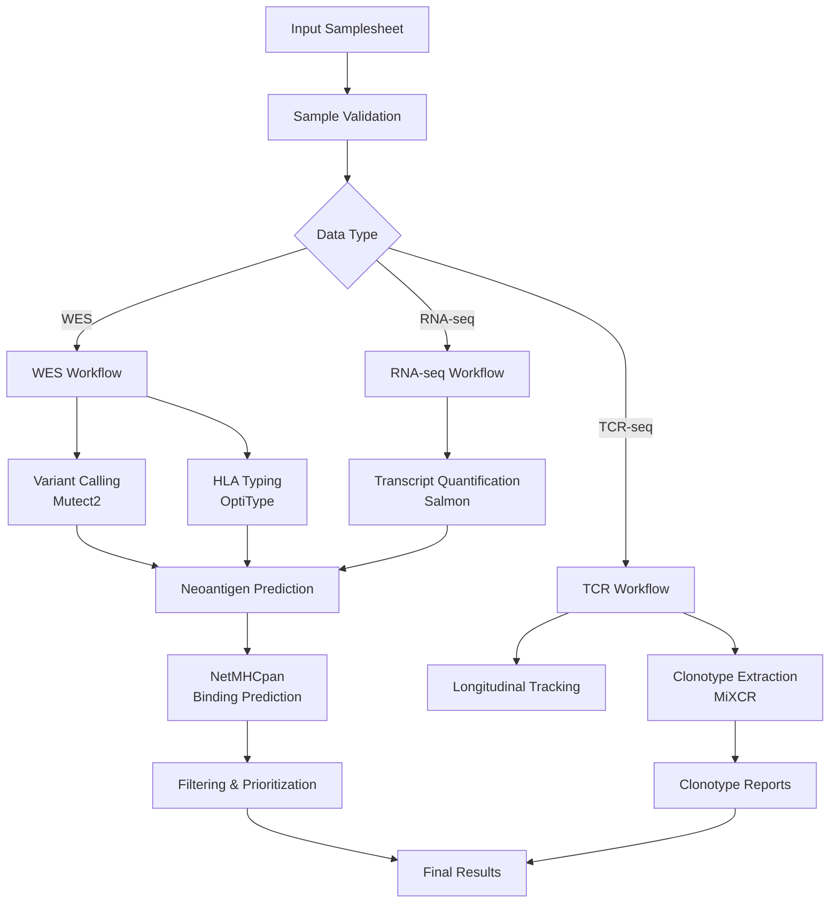

# Immune Repertoire + Neoantigen Pipeline

A comprehensive Nextflow pipeline for immune repertoire and neoantigen prediction in lung cancer patients, integrating WES, RNA-seq, and TCR-seq data from tumor and cfDNA samples collected longitudinally.

## Overview

This pipeline provides a modular, reproducible, and scalable solution for:
- **Variant calling** from WES data using Mutect2
- **Transcript quantification** from RNA-seq using Salmon
- **TCR clonotype extraction** from TCR-seq using MiXCR
- **Neoepitope generation** and MHC binding prediction with NetMHCpan
- **Longitudinal sample tracking** and metadata management
- **HLA typing** integration across multiple assays

## Features

- **Modular design**: Each analysis stage is isolated and restartable
- **Docker containerization**: All tools wrapped in Docker containers
- **Multi-environment support**: Runs on HPC (SLURM) and AWS
- **Failure recovery**: Checkpointing and granular resource declarations
- **Automated validation**: Control samples and test profiles
- **Metadata synchronization**: Channel-based logic for sample tracking

## Quick Start

```bash
# Clone the repository
git clone https://github.com/lilei1/immune_neoantigen_pipeline.git
cd immune_neoantigen_pipeline

# Run with test data
nextflow run main.nf -profile test

# Run on SLURM cluster
nextflow run main.nf -profile slurm --input samples.csv --outdir results

# Run on AWS
nextflow run main.nf -profile aws --input samples.csv --outdir s3://bucket/results
```

## Input Requirements

### Sample Sheet Format
The pipeline expects a CSV file with the following columns:
- `sample_id`: Unique sample identifier
- `patient_id`: Patient identifier for longitudinal tracking
- `timepoint`: Collection timepoint (e.g., baseline, cycle1, progression)
- `sample_type`: tumor, cfDNA, or PBMC
- `wes_r1`, `wes_r2`: WES FASTQ files (if available)
- `rna_r1`, `rna_r2`: RNA-seq FASTQ files (if available)
- `tcr_r1`, `tcr_r2`: TCR-seq FASTQ files (if available)
- `hla_alleles`: HLA typing (if known, otherwise will be predicted)

### Reference Files
- Human reference genome (GRCh38)
- GENCODE gene annotations
- dbSNP and COSMIC variant databases
- NetMHCpan allele definitions

## Pipeline Architecture

The pipeline is built with a modular architecture using Nextflow DSL2:

### Core Components

1. **Main Workflow** (`main.nf`): Orchestrates all sub-workflows
2. **Sub-workflows** (`workflows/`): Specialized processing for each data type
3. **Modules** (`modules/`): Individual tool implementations
4. **Configuration** (`conf/`): Environment-specific settings
5. **Utilities** (`bin/`): Helper scripts and tools

### Data Flow



## Key Features Implemented

### 🧬 Multi-omics Integration
- **WES Processing**: Mutect2 variant calling with tumor-normal pairing
- **RNA-seq Analysis**: Salmon transcript quantification with expression profiling
- **TCR-seq Analysis**: MiXCR clonotype extraction and longitudinal tracking
- **HLA Typing**: OptiType integration for MHC class I typing

### 🔄 Longitudinal Analysis
- **Sample Metadata Management**: Patient-timepoint tracking across assays
- **Clonotype Persistence**: Track T-cell clones across treatment timepoints
- **Variant Evolution**: Monitor somatic mutations over time
- **Expression Changes**: Analyze transcript expression dynamics

### 🎯 Neoantigen Prediction
- **Peptide Generation**: Extract mutant peptides from variants
- **MHC Binding Prediction**: NetMHCpan integration for multiple HLA alleles
- **Expression-based Prioritization**: Combine binding affinity with RNA expression
- **Filtering Pipeline**: Customizable thresholds for clinical relevance

### 🏗️ Robust Architecture
- **Modular Design**: Independent, reusable workflow components
- **Failure Recovery**: Checkpointing and granular resource management
- **Multi-environment Support**: HPC (SLURM) and cloud (AWS) execution
- **Container Integration**: Docker/Singularity for reproducibility

### 📊 Quality Control & Validation
- **Automated QC**: FastQC and MultiQC integration
- **Metadata Validation**: Comprehensive samplesheet checking
- **Test Profiles**: Built-in validation with control samples
- **Continuous Integration**: GitHub Actions for automated testing

## Output Structure

```
results/
├── qc/                     # Quality control reports
│   ├── fastqc/            # FastQC reports for all samples
│   └── multiqc/           # Aggregated QC report
├── variants/               # Variant calling results
│   ├── {sample}/          # Per-sample variant calls
│   └── merged/            # Patient-level merged variants
├── transcripts/            # RNA-seq quantification
│   ├── {sample}/          # Per-sample Salmon results
│   └── merged/            # Patient-level expression matrices
├── tcr/                   # TCR analysis results
│   ├── {sample}/          # Per-sample clonotype data
│   └── tracking/          # Longitudinal tracking results
├── neoantigens/           # Neoantigen predictions
│   ├── peptides/          # Generated peptide sequences
│   ├── predictions/       # NetMHCpan binding predictions
│   └── prioritized/       # Filtered and ranked neoantigens
├── hla/                   # HLA typing results
│   └── {sample}/          # Per-sample HLA calls
├── reports/               # Summary reports and visualizations
│   ├── clonotype_tracking/ # TCR tracking plots
│   └── neoantigen_summary/ # Neoantigen analysis summaries
└── pipeline_info/         # Execution reports and logs
    ├── execution_report.html
    ├── execution_timeline.html
    └── execution_trace.txt
```

## Configuration Profiles

- `test`: Small test dataset for validation
- `slurm`: SLURM cluster execution
- `aws`: AWS Batch execution
- `docker`: Local execution with Docker
- `singularity`: Local execution with Singularity

## Dependencies

All dependencies are containerized. The pipeline uses:
- GATK 4.x (Mutect2)
- Salmon 1.x
- MiXCR 4.x
- NetMHCpan 4.x
- OptiType (HLA typing)
- MultiQC

## Citation

If you use this pipeline, please cite:
[Your publication details here]

## Support

For questions and support, please open an issue on GitHub or contact [your email].